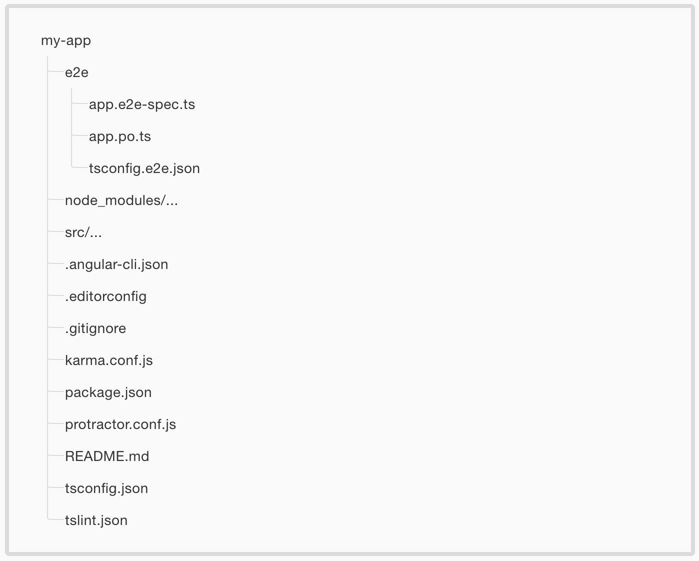
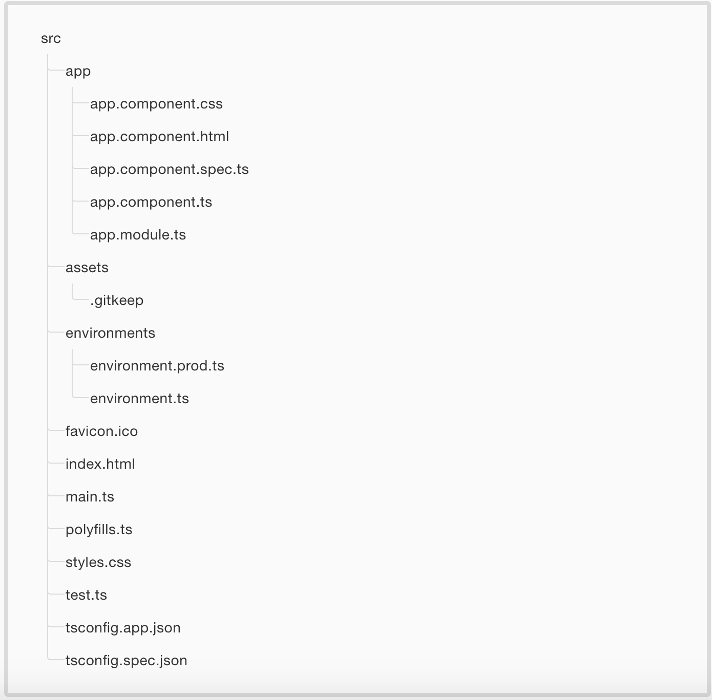

# Directorio raíz

El directorio raíz de un proyecto angular contiene los siguientes elementos:

* **e2e/:** end-to-end tests
* **node_modules/:** módulos de terceros listados en package.json.
* **src/:** Directorio donde reside la aplicación
* **.angular-cli.json:** Fichero de configuración de angular.
* **.editorconfig:** Configuración para el editor (para intentar que todo el equipo de desarrollo utilice la misma configuración). (http://editorconfig.org)
* **.gitignore:** archivos a ignorar por Git
* **karma.conf.js:** Configuración de Karma (para tests unitarios)
* **package.json:** Lista de paquetes de terceros que usa el proyecto.
* **protractor.conf.js:** Configuración para Protactor (para tests end-to-end)
* **README.md:** Pre-relleno con información sobre comandos de angular.
* **tsconfig.json:** Configuración para TypeScript para el IDE
* **tslint.json:** Configuración para TSLint

El directorio src/ tiene la estructura siguiente:

* **app/app.component.{ts,html,css,spec.ts}:** El componente raíz de la aplicación (archivo typescript, archivo html, archivo css y archivo spec.ts para test).
* **app/app.module.ts:** Define el módulo AppModule, (el módulo raíz) que le dice a angular cómo ensamblar la aplicación.
* **assets/:** Directorio para los assets (se copiará tal cual al construir la aplicación).
* **environments/:** Este directorio contiene un archivo por cada entorno. En el se encuentra la configuración de algunas variables que se utilizan en la aplicación. Por ejemplo, quizás utilices una API REST diferente durante el desarrollo que la que utilizarás en producción, diferentes tokens de analytics, servicios mock... Angular cli elige el fichero adecuado en cada caso.
* **favicon.ico:** El icono favicon.
* **index.html:** El html principal.
* **main.ts:** El punto de entrada principal de la aplicación.
* **polyfills.ts:**
Cada navegador tiene diferente grado de soporte de los estándares web. Polyfills es una librería javascipt que normaliza esas diferencias.
* **styles.css:** Estilos css globales de la aplicación.
* **test.ts:** Punto de entrada principal a los tests unitarios.
* **tsconfig.app.json:** Configuración del compilador TypeScript para la aplicación angular.
* **tsconfig.spec.json:** Configuración del compilador TypeScript para los tests unitarios(tsconfig.spec.json).
