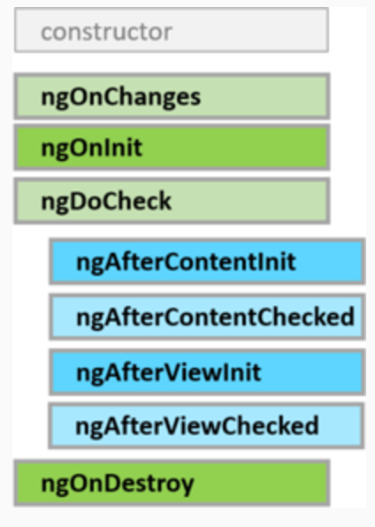

# Ciclo de vida de un componente

Un componente tiene un ciclo de vida gestionado por Angular.

Angular crea el componente, lo renderiza, crea y renderiza a sus "hijos", lo chequea cuando sus datos bindeados cambian y lo destruye antes de quitarlo del DOM.

Angular ofrece hooks de cada paso del ciclo de vida para proporcionar la habilidad de actuar cuando tienen lugar.

Una directiva tiene el mismo conjunto de *lifecycle hooks* excepto aquellos específicos al contenido del componente y las vistas.

## Sequencia del ciclo de vida

- **ngOnChanges():** 
Es llamado cuando Angular establece datos asociados a propiedades asociadas a @Input. El método recibe un objetco SimpleChanges con el valor actual y el valor anterior.
Es llamado antes de ngOnInit() y cuando uno o más @Input variables cambie.
- **ngOnInit():**	
Initialize the directive/component after Angular first displays the data-bound properties and sets the directive/component's input properties.
Called once, after the first ngOnChanges().
- **ngDoCheck():**
Para checkear cambios que Angular no sea capaz de detectar por sí mismo. Es llamado después de cada ngOnChanges() y ngOnInit().
- **ngAfterContentInit():**
Es llamado después de que Angular proyecte el contenido externo dentro de la vista del componente. Es llamado después del primer ngDoCheck().
Sólo disponible para componentes.
- **ngAfterContentChecked():**	
Responde después de que Angular compruebe el contenido proyectado en el componente.
Es llamado después de cada  ngAfterContentInit() y de cada ngDoCheck().
Sólo disponible para componentes.
- **ngAfterViewInit():**	
Responde después de que Angular inicialice la vista del componente y las vistas hijas.
Es llamado una sola vez después del primer ngAfterContentChecked().
Sólo disponible para componentes.
- **ngAfterViewChecked():**	
Responde después de que Angular compruebe la vista del componente y las vistas hijas.
Es llamado después de ngAfterViewInit y de cada ngAfterContentChecked().
Sólo disponible para componentes.
- **ngOnDestroy():**
Es llamado usto antes de que Angular destruya el componente. Se puede utilizar por ejemplo para desuscribirse de los observables.

[Índice](index.md)
